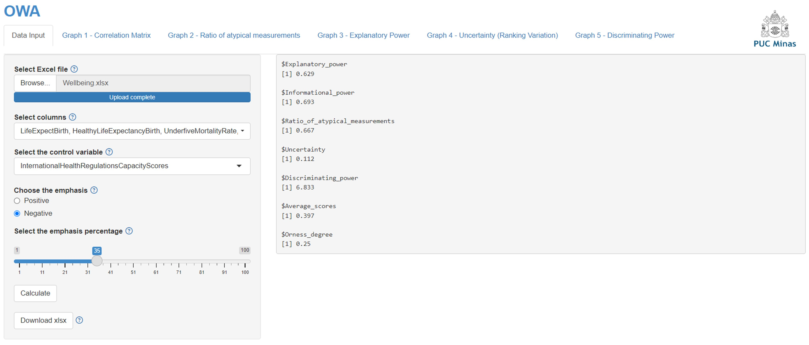

# OWA

### Prerequisites

The software can be used in two ways, namely:
- Web
- IDE (For example: RStudio)

To use it on the web, you need to access https://ci-owa.shinyapps.io/ci-owa-v1/
To use it in an IDE, you must download the code available on github (https://github.com/LauraCozzi/OWA) or codeocean (https://codeocean.com/capsule/9687929)

### Tests

To test the software after executing any of the options above, simply access the Examples folder found on github (https://github.com/LauraCozzi/OWA) or codeocean (https://codeocean.com/capsule/9687929)

### Technologies

The application was made in R using the Shiny library

### How to use

Firstly, data in Excel format must be loaded from the "Browse" button. 
Next, selecting the sub-indicators of the composite indicator in "Select columns" is necessary. 
Finally, the external variable is marked in "Select the control variable."
 
Once the data is uploaded into the software, it is possible to analyze:
  - density curve;
  - histogram;
  - sub-indicator correlations.

Just by clicking on "Graph 1 – Correlation Matrix".

 
The software uses the sign of the correlations between the sub-indicators and external variable to standardize the polarity of the sub-indicators. 
After clicking “Calculate”, sub-indicators with negative polarities are multiplied by minus one.
Then, equation (1) is applied to normalize the scale of the sub-indicators to the interval [0,1]. 
From this point on, the software tabs allow to obtain graphs of quality measures:
  - ranking uncertainty;
  - proportion of atypical measurements;
  - explanatory power;
  - discriminating power;
 
Note that the software does not offer a graph for informational power. 
The result of this test is presented numerically along with the other tests.

The intensity of the emphasis vary on a scale from zero to one. 
One is equivalent to an emphasis that adds only the sub-indicator with the highest value.
Zero is equivalent to no emphasis, which adds all sub-indicators with equal weights, equivalent to the method SAW.
 
The intensity of the emphasis (called Orness degree), and the average value of the composite indicator scores.

### Authors

- Cristiane Nobre Neri
- Douglas Alexandre Gomes Vieira
- Hasheem Mannan
- Laura Cozzi Ribeiro
- Matheus Pereira Libório
- Petr Iakovlevich Ekel
